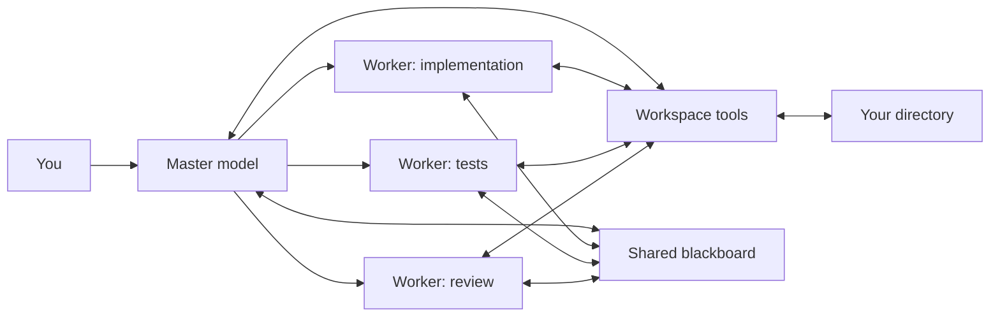

# MAR

**Multi-Agent Router** is a model-agnostic coding runtime for the terminal. One master model coordinates specialized workers, all operating on the same directory with explicit permissions, shared memory, tool use, verification, and model fallbacks.

MAR is not tied to one AI vendor. A Claude master can delegate frontend work to Gemini, backend work to an OpenAI-compatible endpoint, and tests to a local Ollama model in the same session.

> MAR is an early production-oriented release. Keep approval mode enabled until you trust your models, configuration, and plugins.

## Why MAR

- **Any model:** OpenAI-compatible APIs, Anthropic, Gemini, and Ollama are built in. OpenRouter, Groq, Mistral, DeepSeek, xAI, LM Studio, vLLM, and other compatible gateways only need a base URL.
- **A real team:** choose a master and up to eight workers during onboarding. Every agent may use a different provider and model.
- **Shared workspace:** agents inspect, search, edit, run checks, view diffs, and exchange notes in one selected directory.
- **Parallel delegation:** independent worker calls emitted together by the master run concurrently; the master integrates and verifies their work.
- **Portable and private:** Node.js 20+, no runtime dependencies, no daemon, no `sudo`, and local models work through Ollama.
- **Modular:** provider plugins, tool plugins, per-project configuration, agent prompts, model options, and ordered fallbacks are public interfaces.
- **Controlled:** interactive approval is the default. Read-only and explicitly autonomous modes are available.



## Install

The user-local installer needs Node.js 20+, npm, Git, curl, and tar. It never invokes `sudo`:

```bash
curl -fsSL https://raw.githubusercontent.com/kudasaixc/mar/main/install.sh | bash
```

Or install directly with a JavaScript package manager:

```bash
npm install --global github:kudasaixc/mar
# pnpm add --global github:kudasaixc/mar
# bun add --global github:kudasaixc/mar
```

Tagged releases can be pinned with the installer:

```bash
curl -fsSL https://raw.githubusercontent.com/kudasaixc/mar/main/install.sh | MAR_VERSION=0.1.0 bash
```

When the package is published to npm, `npm install -g @kudasaixc/mar` and the equivalent pnpm, Yarn, and Bun commands use the same artifact. See [distribution options](docs/distribution.md).

## One-minute onboarding

```bash
mar init
```

The wizard asks for:

1. the master provider, model ID, name, and role;
2. zero to eight worker providers, model IDs, and specialties;
3. the safety mode.

MAR stores only the **name** of each API-key environment variable in `~/.config/mar/config.json`, never the key itself. Export the requested keys in your shell:

```bash
export ANTHROPIC_API_KEY="..."
export GEMINI_API_KEY="..."
export OPENAI_API_KEY="..."
```

Ollama does not require a key. Use any installed tool-capable model ID.

## Use

Start an ongoing session in the current project:

```bash
cd my-project
mar
```

Run a single task:

```bash
mar run "Implement the API, delegate tests and review, then verify the result"
mar "Explain this repository without changing it" --read-only
mar "Fix all failing tests" --yes
mar run "Audit this module" --dir ./packages/core
```

Inside chat, use `/agents`, `/diff`, `/notes`, `/clear`, `/help`, and `/exit`.

`--yes` permits agents to edit and execute commands without prompting. MAR still applies workspace path checks and a small destructive-command denylist, but this is **not an OS sandbox**. Use a container or VM for untrusted repositories or models.

## Configure model mixtures

Global configuration lives at `~/.config/mar/config.json`. A repository may add `mar.config.json` to override it. Fallbacks are ordered:

```json
{
  "version": 1,
  "providers": {
    "local": { "kind": "ollama", "baseUrl": "http://localhost:11434" },
    "router": {
      "kind": "openai-compatible",
      "baseUrl": "https://openrouter.ai/api/v1",
      "apiKeyEnv": "OPENROUTER_API_KEY"
    }
  },
  "team": {
    "master": {
      "name": "architect",
      "description": "Owns architecture and final verification.",
      "provider": "router",
      "model": "your-master-model",
      "fallbacks": [{ "provider": "local", "model": "qwen3-coder" }]
    },
    "workers": [
      {
        "name": "tests",
        "description": "Builds adversarial tests and runs them.",
        "provider": "local",
        "model": "qwen3-coder"
      }
    ]
  },
  "runtime": {
    "approval": "on-request",
    "commandTimeoutMs": 120000,
    "maxToolOutput": 30000,
    "plugins": []
  }
}
```

Read the full [configuration reference](docs/configuration.md), [architecture](docs/architecture.md), [plugin API](docs/plugins.md), and [security model](SECURITY.md).

## Commands

| Command | Purpose |
|---|---|
| `mar` / `mar chat` | Interactive coding session |
| `mar init` | Configure a model team |
| `mar run "…"` | Execute one task |
| `mar models` | Show master and workers |
| `mar models --available` | Query provider model catalogs where supported |
| `mar doctor` | Check Node, Git, workspace, config, and key variables |
| `mar config show` | Print the merged configuration |
| `mar completion bash\|zsh\|fish` | Generate shell completion |

## Development

```bash
git clone https://github.com/kudasaixc/mar.git
cd mar
npm ci
npm test
node dist/cli.js --help
```

MAR is MIT licensed. Contributions are welcome; see [CONTRIBUTING.md](CONTRIBUTING.md).
